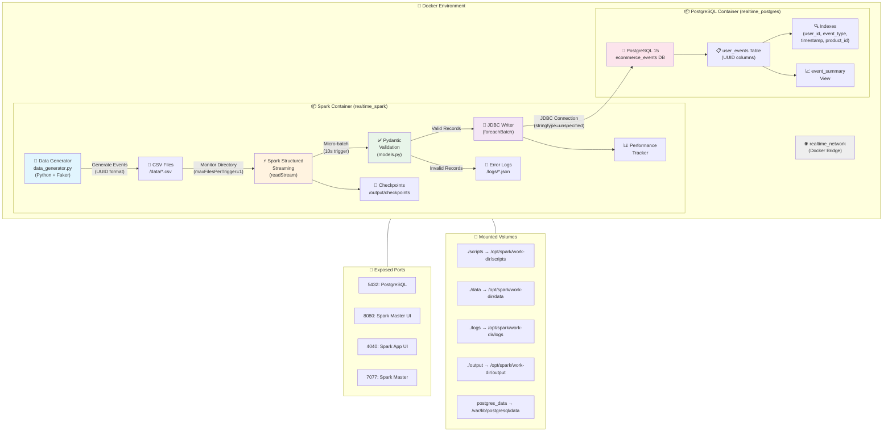
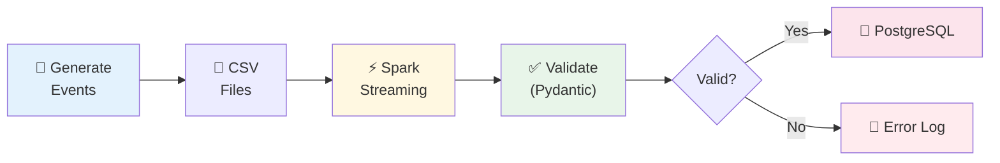

# Real-Time Data Ingestion Using Spark Structured Streaming & PostgreSQL

A real-time data pipeline that simulates an e-commerce platform tracking user activity. This project demonstrates how to generate fake user events, stream them using Apache Spark Structured Streaming, and store processed data in a PostgreSQL database.

## Table of Contents

- [Project Summary](#project-summary)
- [Learning Objectives](#learning-objectives)
- [Architecture Overview](#architecture-overview)
- [Project Structure](#project-structure)
- [Prerequisites](#prerequisites)
- [Quick Start](#quick-start)
- [Detailed Usage](#detailed-usage)
- [Components](#components)
- [Deliverables](#deliverables)
- [Troubleshooting](#troubleshooting)

## Project Summary

This project builds a complete real-time data ingestion pipeline that:

1. **Simulates Data**: Generates fake e-commerce events (product views, purchases, cart actions) as CSV files
2. **Streams with Spark**: Uses Spark Structured Streaming to monitor and process new CSV files in real-time
3. **Stores in PostgreSQL**: Writes processed data to a PostgreSQL database for querying and analytics

### Key Features

- Real-time data streaming and processing
- Data transformation using Spark SQL
- **Pydantic-based data validation** with detailed error logging
- **UUID-typed identifiers** for data integrity
- **Performance metrics tracking** (throughput, latency, validation rates)
- Relational database integration with PostgreSQL
- Continuous data ingestion handling
- Docker-based containerized environment

## Learning Objectives

By completing this project, you will:

- Simulate and ingest streaming data
- Use Spark Structured Streaming to process data in real-time
- Store and verify processed data in a PostgreSQL database
- Understand the architecture of a real-time data pipeline
- Measure and evaluate system performance

## Architecture Overview

### System Architecture Diagram



#### Data Flow Summary



### Component Details

#### 1️⃣ **Data Generation Layer**
- **Component**: `data_generator.py` (Python + Faker library)
- **Location**: Spark container
- **Function**: Generates realistic e-commerce events (views, purchases, cart actions)
- **Output**: CSV files with 11 fields (event_id, user_id, product info, timestamps)
- **Configuration**: Customizable batches, intervals, and event counts

#### 2️⃣ **Streaming Processing Layer**
- **Component**: Spark Structured Streaming
- **Location**: Spark container (realtime_spark)
- **Function**: 
  - Monitors `./data/` directory for new CSV files
  - Processes files in micro-batches (trigger: 10 seconds)
  - Validates data against predefined schema
  - Transforms timestamps and data types
  - Maintains checkpoints for fault tolerance
- **Technology**: Apache Spark 3.x with Python API (PySpark)

#### 3️⃣ **Storage Layer**
- **Component**: PostgreSQL 15 Database
- **Location**: PostgreSQL container (realtime_postgres)
- **Function**: 
  - Stores processed events in `user_events` table
  - Provides indexed columns for optimized queries
  - Maintains `event_summary` view for analytics
  - Auto-initializes schema on container startup
- **Persistence**: Docker volume ensures data survives container restarts

#### 4️⃣ **Networking & Communication**
- **Docker Network**: `realtime_network` (bridge driver)
- **Inter-container DNS**: Spark accesses PostgreSQL via hostname `postgres`
- **JDBC Connection**: PostgreSQL JDBC driver (version 42.7.1)
- **Port Mappings**:
  - `5432`: PostgreSQL database
  - `8080`: Spark Master Web UI
  - `7077`: Spark Master (cluster communication)
  - `4040`: Spark Application UI (active jobs only)

### Technology Stack

| Layer | Technology | Purpose |
|-------|-----------|---------|
| **Orchestration** | Docker Compose | Container management & networking |
| **Stream Processing** | Apache Spark 3.x | Real-time data processing |
| **Data Generation** | Python + Faker | Synthetic event generation |
| **Database** | PostgreSQL 15 | Persistent storage & analytics |
| **Connectivity** | JDBC Driver | Spark-PostgreSQL communication |
| **Monitoring** | Spark Web UI | Job tracking & performance metrics |

### Key Features

- ✅ **Real-time Processing**: ~2 second latency from generation to storage
- ✅ **High Throughput**: Up to 15.98 records/second (30x improvement with batching)
- ✅ **Data Validation**: Pydantic-based validation with detailed error logging
- ✅ **UUID Identifiers**: Native PostgreSQL UUID types for data integrity
- ✅ **Fault Tolerance**: Checkpoint-based recovery mechanism
- ✅ **Scalability**: Docker-based horizontal scaling capability
- ✅ **Schema Enforcement**: Strict validation of incoming data
- ✅ **Performance Tracking**: Automated metrics collection and reporting
- ✅ **Data Persistence**: Volume-backed PostgreSQL storage
- ✅ **Monitoring**: Built-in Spark UI for job observability
- ✅ **Containerization**: Isolated, reproducible environment

## Project Structure

```
.
├── docker-compose.yml              # Docker orchestration configuration
├── Dockerfile.spark                # Spark container definition
├── README.md                       # This file
├── requirements.txt                # Python dependencies
├── user_guide.md                   # Detailed usage instructions
├── performance_metrics.md          # System performance report with test results
├── postgres_connection_details.txt # Database connection information
│
├── scripts/
│   ├── data_generator.py           # Generates fake e-commerce events (UUID format)
│   ├── spark_streaming_to_postgres.py  # Spark streaming job with validation
│   ├── models.py                   # Pydantic models for data validation
│   ├── performance_tracker.py      # Performance metrics tracking
│   └── test_uuid_validation.py     # Unit tests for validation
│
├── sql/
│   └── postgres_setup.sql          # Database schema with UUID types
│
├── logs/                           # Validation and performance logs
│   ├── validation_errors.log       # Human-readable validation errors
│   ├── validation_errors_detailed.json  # JSON format for analysis
│   └── performance_metrics.json    # Per-batch performance data
│
├── data/                           # Input directory (monitored by Spark)
├── output/                         # Spark checkpoints and output
└── .gitignore                      # Git ignore rules
```

## Prerequisites

Before starting, ensure you have:

- **Docker Desktop** installed and running
- **Docker Compose** (included with Docker Desktop)
- **Terminal/PowerShell** access
- **At least 4GB RAM** available for Docker
- **Internet connection** (for downloading Docker images)

## Quick Start

### 1. Start the Environment

```bash
# Navigate to project directory
cd "path/to/project"

# Build and start containers
docker-compose up -d --build
```

Wait for both containers to be healthy (about 30-60 seconds).

### 2. Verify Containers

```bash
docker-compose ps
```

You should see both `realtime_postgres` and `realtime_spark` running.

### 3. Start Spark Streaming

```bash
# Enter Spark container
docker exec -it realtime_spark bash

# Run the streaming job
spark-submit --jars /opt/spark/jars/postgresql-42.7.1.jar scripts/spark_streaming_to_postgres.py
```

Keep this terminal running - it monitors for new CSV files.

### 4. Generate Data

In a **new terminal**:

```bash
# Enter Spark container
docker exec -it realtime_spark bash

# Generate test data
python3 scripts/data_generator.py --events 10 --batches 5 --interval 3
```

### 5. Verify Data in PostgreSQL

```bash
# Enter PostgreSQL container
docker exec -it realtime_postgres psql -U lab_user -d ecommerce_events

# Check records
SELECT COUNT(*) FROM user_events;

# View recent events
SELECT * FROM user_events ORDER BY event_timestamp DESC LIMIT 10;

# Exit
\q
```

## Detailed Usage

### Data Generator Options

```bash
# Generate a single batch of 10 events
python3 scripts/data_generator.py

# Generate 5 batches of 20 events each, 3 seconds apart
python3 scripts/data_generator.py --events 20 --batches 5 --interval 3

# Run continuously until interrupted
python3 scripts/data_generator.py --events 10 --interval 5 --continuous
```

**Parameters:**
- `--events N`: Number of events per batch (default: 10)
- `--batches N`: Number of batches to generate (default: 1)
- `--interval SECONDS`: Seconds between batches (default: 5.0)
- `--continuous`: Run continuously until Ctrl+C

### Spark Streaming Job

The streaming job:
- Monitors `/opt/spark/work-dir/data` for new CSV files
- Processes files in micro-batches (every 10 seconds)
- Transforms and validates data
- Writes to PostgreSQL `user_events` table
- Maintains checkpoints in `/opt/spark/work-dir/output/checkpoints`

### Accessing Spark Web UIs

- **Spark Master UI**: http://localhost:8080
- **Spark Application UI**: http://localhost:4040

### Stopping the Environment

```bash
# Stop containers (preserves data)
docker-compose stop

# Stop and remove containers (data persists in volume)
docker-compose down

# Stop and remove everything including data
docker-compose down -v
```

## Components

### 1. Data Generator (`scripts/data_generator.py`)

Generates realistic e-commerce events including:
- **UUIDs**: Standard UUID format for event_id, user_id, session_id
- Event types: view, add_to_cart, remove_from_cart, purchase, wishlist
- Product information: ID (PROD###), name, category, price
- User data: UUID-based user ID, session ID, device type
- Timestamps: event and creation timestamps
- **Session simulation**: 70% chance to reuse existing users for realistic patterns

### 2. Spark Streaming Job (`scripts/spark_streaming_to_postgres.py`)

- Monitors directory for new CSV files using `readStream`
- Uses `foreachBatch` for custom micro-batch processing
- **Pydantic validation** before database writes
- **Performance tracking** for throughput and latency metrics
- Writes to PostgreSQL using JDBC with `stringtype=unspecified` for UUID casting
- Maintains checkpoints for fault tolerance
- Graceful shutdown with performance summary

### 3. Data Validation (`scripts/models.py`)

- **Pydantic BaseModel** for schema validation
- UUID format validation using regex patterns
- Business rule enforcement (event types, price >= 0, quantity >= 1)
- Detailed error logging to files for debugging
- JSON-formatted error logs for analysis

### 4. Performance Tracking (`scripts/performance_tracker.py`)

- Per-batch metrics: throughput, latency, validation rates
- Aggregate statistics: min, max, average, median
- JSON output for analysis
- Summary report generation on shutdown

### 5. PostgreSQL Setup (`sql/postgres_setup.sql`)

Creates:
- `user_events` table with **UUID columns** (event_id, user_id, session_id)
- `uuid-ossp` extension for UUID support
- Indexes on user_id, event_type, timestamp, product_id
- `event_summary` view for analytics
- User permissions

### 6. Docker Configuration

- **PostgreSQL 15**: Database with automatic schema initialization via mounted SQL
- **Spark 3.5.0**: Custom image with Python dependencies and JDBC driver
- **Networking**: Bridge network (`realtime_network`) for container communication
- **Volumes**: 
  - `./scripts` → `/opt/spark/work-dir/scripts`
  - `./data` → `/opt/spark/work-dir/data`
  - `./logs` → `/opt/spark/work-dir/logs`
  - `./output` → `/opt/spark/work-dir/output`

## Deliverables

| Deliverable | Description | Status |
|-------------|-------------|--------|
| `data_generator.py` | Python script to generate CSV event data with UUIDs | ✅ Complete |
| `spark_streaming_to_postgres.py` | Spark Structured Streaming job with validation | ✅ Complete |
| `models.py` | Pydantic models for data validation | ✅ Complete |
| `performance_tracker.py` | Performance metrics tracking module | ✅ Complete |
| `postgres_setup.sql` | SQL script with UUID types and indexes | ✅ Complete |
| `postgres_connection_details.txt` | Connection information | ✅ Complete |
| `user_guide.md` | Step-by-step instructions | ✅ Complete |
| `performance_metrics.md` | System performance report with test results | ✅ Complete |
| `system_architecture.png` | Data flow diagram | ✅ Complete |
| `README.md` | Project overview and documentation | ✅ Complete |

## Testing Checklist

- [x] CSV files are being generated correctly (with UUID format)
- [x] Spark detects and processes new files
- [x] Data transformations are correct
- [x] Data validation works (Pydantic models)
- [x] Data is written to PostgreSQL without errors
- [x] Performance metrics are within expected limits (11.95 rec/sec achieved)
- [x] Checkpoints are created and maintained
- [x] Error handling works correctly (validation errors logged)
- [x] Database indexes improve query performance
- [x] UUID type casting works with PostgreSQL

## Performance Highlights

Based on actual testing (see `performance_metrics.md` for details):

| Metric | 1 Event/Batch | 20 Events/Batch | Improvement |
|--------|---------------|-----------------|-------------|
| **Throughput** | 0.39 rec/sec | 11.95 rec/sec | **30x faster** |
| **Peak Throughput** | 0.51 rec/sec | 15.98 rec/sec | **31x faster** |
| **Avg Latency** | 2,297 ms | 1,830 ms | 20% faster |
| **Validation Rate** | 100% | 100% | ✅ Perfect |

**Key Insight**: Batch size is the most important tuning parameter. Database write overhead is amortized across all records in a batch.

## Troubleshooting

| Issue | Solution |
|-------|----------|
| Container won't start | Run `docker-compose logs <service>` to check errors |
| Spark can't connect to PostgreSQL | Ensure postgres container is healthy first: `docker-compose ps` |
| No data appearing in database | Check that CSV files exist in `data/` folder |
| JDBC driver not found | Verify JAR exists: `docker exec realtime_spark ls /opt/spark/jars/` |
| Permission denied errors | Check file permissions in mounted volumes |
| Port already in use | Stop other services using ports 5432, 8080, 7077, or 4040 |

### Useful Debugging Commands

```bash
# View container logs
docker-compose logs spark
docker-compose logs postgres

# Check container status
docker-compose ps

# Inspect container
docker exec -it realtime_spark bash
docker exec -it realtime_postgres bash

# Check disk usage
docker system df

# Restart a service
docker-compose restart spark
```

## Database Schema

### user_events Table

| Column | Type | Nullable | Description |
|--------|------|----------|-------------|
| id | SERIAL | NOT NULL | Primary key (auto-increment) |
| event_id | **UUID** | NOT NULL | Unique event identifier (format: xxxxxxxx-xxxx-xxxx-xxxx-xxxxxxxxxxxx) |
| user_id | **UUID** | NOT NULL | User identifier (UUID format) |
| event_type | VARCHAR(20) | NOT NULL | Type of event (view, add_to_cart, remove_from_cart, purchase, wishlist) |
| product_id | VARCHAR(50) | NOT NULL | Product identifier (format: PROD###) |
| product_name | VARCHAR(255) | NOT NULL | Product name |
| product_category | VARCHAR(100) | NULL | Product category |
| product_price | DECIMAL(10,2) | NULL | Product price (must be >= 0) |
| quantity | INTEGER | NULL | Quantity (default: 1, must be >= 1) |
| event_timestamp | TIMESTAMP | NOT NULL | When the event occurred |
| session_id | **UUID** | NULL | User session identifier (UUID format) |
| device_type | VARCHAR(20) | NULL | Device type (mobile, desktop, tablet) |
| created_at | TIMESTAMP | NOT NULL | When record was created in database (auto-generated) |

### Indexes

| Index Name | Column | Purpose |
|------------|--------|---------|
| `idx_user_events_user_id` | user_id | Fast user lookup |
| `idx_user_events_event_type` | event_type | Fast event type filtering |
| `idx_user_events_timestamp` | event_timestamp | Time-based queries |
| `idx_user_events_product_id` | product_id | Product analytics |

### Views

**`event_summary`** - Aggregated analytics view:
```sql
SELECT event_type, COUNT(*) as event_count, 
       COUNT(DISTINCT user_id) as unique_users,
       COUNT(DISTINCT product_id) as unique_products,
       SUM(product_price * quantity) as total_value
FROM user_events GROUP BY event_type;
```

### UUID Extension

The database uses PostgreSQL's native UUID type for identifiers, requiring:
```sql
CREATE EXTENSION IF NOT EXISTS "uuid-ossp";
```

## Tools & Technologies

| Technology | Version | Purpose |
|------------|---------|---------|
| **Apache Spark** | 3.5.0 | Real-time structured streaming |
| **PostgreSQL** | 15 | Relational database with UUID support |
| **Python** | 3.10 | Data generation and scripting |
| **Pydantic** | 2.x | Data validation and schema enforcement |
| **Docker & Compose** | Latest | Containerization and orchestration |
| **Faker** | Latest | Fake data generation library |
| **PostgreSQL JDBC** | 42.7.1 | Spark-PostgreSQL connectivity |

## Additional Resources

- [Apache Spark Documentation](https://spark.apache.org/docs/latest/)
- [Spark Structured Streaming Guide](https://spark.apache.org/docs/latest/structured-streaming-programming-guide.html)
- [PostgreSQL Documentation](https://www.postgresql.org/docs/)
- [Docker Compose Documentation](https://docs.docker.com/compose/)

## License

This project is for educational purposes as part of the Data Engineering course.

## Author

Created as part of Module 5: Real-Time Data Ingestion Lab

---

**Note**: For detailed step-by-step instructions, see [user_guide.md](user_guide.md)
