# Real-Time Data Ingestion Using Spark Structured Streaming & PostgreSQL

A real-time data pipeline that simulates an e-commerce platform tracking user activity. This project demonstrates how to generate fake user events, stream them using Apache Spark Structured Streaming, and store processed data in a PostgreSQL database.

## Table of Contents

- [Project Summary](#project-summary)
- [Learning Objectives](#learning-objectives)
- [Architecture Overview](#architecture-overview)
- [Project Structure](#project-structure)
- [Prerequisites](#prerequisites)
- [Quick Start](#quick-start)
- [Detailed Usage](#detailed-usage)
- [Components](#components)
- [Deliverables](#deliverables)
- [Troubleshooting](#troubleshooting)

## Project Summary

This project builds a complete real-time data ingestion pipeline that:

1. **Simulates Data**: Generates fake e-commerce events (product views, purchases, cart actions) as CSV files
2. **Streams with Spark**: Uses Spark Structured Streaming to monitor and process new CSV files in real-time
3. **Stores in PostgreSQL**: Writes processed data to a PostgreSQL database for querying and analytics

### Key Features

- Real-time data streaming and processing
- Data transformation using Spark SQL
- Relational database integration
- Continuous data ingestion handling
- Docker-based containerized environment

## Learning Objectives

By completing this project, you will:

- Simulate and ingest streaming data
- Use Spark Structured Streaming to process data in real-time
- Store and verify processed data in a PostgreSQL database
- Understand the architecture of a real-time data pipeline
- Measure and evaluate system performance

## Architecture Overview

### System Architecture Diagram

```mermaid
flowchart TB
    subgraph Docker["🐳 Docker Environment"]
        direction TB
        
        subgraph SparkContainer["Spark Container (realtime_spark)"]
            direction TB
            Generator["📊 Data Generator<br/>━━━━━━━━━━━━━━━<br/>data_generator.py<br/>Uses: Faker Library<br/>Generates: E-commerce Events"]
            DataFolder[("💾 Data Folder<br/>━━━━━━━━━━━━━━━<br/>/opt/spark/work-dir/data/<br/>Contains: CSV Files")]
            SparkStream["⚡ Spark Streaming Job<br/>━━━━━━━━━━━━━━━<br/>spark_streaming_to_postgres.py<br/>Trigger: Every 10 seconds<br/>Processes: 1 file per trigger"]
            Checkpoint[("📝 Checkpoints<br/>━━━━━━━━━━━━━━━<br/>/opt/spark/work-dir/output/<br/>Purpose: Fault Tolerance")]
            SparkMaster["🎯 Spark Master<br/>━━━━━━━━━━━━━━━<br/>Port: 7077<br/>Web UI: 8080"]
        end
        
        subgraph PostgresContainer["PostgreSQL Container (realtime_postgres)"]
            direction TB
            InitScript["📜 Init Script<br/>━━━━━━━━━━━━━━━<br/>postgres_setup.sql<br/>Auto-runs on startup"]
            Database[("🗄️ PostgreSQL DB<br/>━━━━━━━━━━━━━━━<br/>Database: ecommerce_events<br/>Port: 5432")]
            EventsTable["📋 user_events Table<br/>━━━━━━━━━━━━━━━<br/>Columns: 13<br/>Indexes: 4"]
            SummaryView["📈 event_summary View<br/>━━━━━━━━━━━━━━━<br/>Purpose: Analytics"]
        end
        
        Network["🌐 Docker Bridge Network<br/>━━━━━━━━━━━━━━━<br/>realtime_network<br/>Enables container communication"]
    end
    
    subgraph Access["🖥️ External Access Points"]
        direction LR
        MasterUI["Spark Master UI<br/>localhost:8080<br/>Always Available"]
        AppUI["Spark App UI<br/>localhost:4040<br/>Only When Job Runs"]
        PSQL["PostgreSQL<br/>localhost:5432<br/>psql/DBeaver/pgAdmin"]
    end
    
    %% Data Flow
    Generator -->|"Writes CSV batches"| DataFolder
    DataFolder -->|"Monitors for new files"| SparkStream
    SparkStream -->|"Updates state"| Checkpoint
    SparkStream -->|"Submits to"| SparkMaster
    SparkStream -->|"JDBC Write<br/>postgresql-42.7.1.jar"| Database
    
    InitScript -.->|"Creates schema"| EventsTable
    InitScript -.->|"Creates view"| SummaryView
    Database --> EventsTable
    EventsTable -->|"Aggregates"| SummaryView
    
    %% External Access
    SparkMaster -.->|"Web Interface"| MasterUI
    SparkStream -.->|"Metrics & Logs"| AppUI
    Database -.->|"SQL Access"| PSQL
    
    %% Network
    Network -.->|"postgres:5432"| SparkStream
    Network -.->|"DNS Resolution"| Database
    
    %% Styling
    classDef genStyle fill:#E3F2FD,stroke:#1565C0,stroke-width:3px,color:#000
    classDef streamStyle fill:#F3E5F5,stroke:#6A1B9A,stroke-width:3px,color:#000
    classDef dbStyle fill:#E8F5E9,stroke:#2E7D32,stroke-width:3px,color:#000
    classDef storageStyle fill:#FFF3E0,stroke:#E65100,stroke-width:3px,color:#000
    classDef accessStyle fill:#FCE4EC,stroke:#C2185B,stroke-width:3px,color:#000
    classDef networkStyle fill:#E0F2F1,stroke:#00695C,stroke-width:3px,color:#000
    
    class Generator genStyle
    class SparkStream,SparkMaster streamStyle
    class Database,EventsTable,SummaryView,InitScript dbStyle
    class DataFolder,Checkpoint storageStyle
    class MasterUI,AppUI,PSQL accessStyle
    class Network networkStyle
```



### Detailed Data Flow Sequence

```mermaid
sequenceDiagram
    autonumber
    participant User as 👤 User
    participant Generator as 📊 Data Generator
    participant FileSystem as 💾 File System<br/>(./data/)
    participant Spark as ⚡ Spark Streaming
    participant Checkpoint as 📝 Checkpoints
    participant Postgres as 🗄️ PostgreSQL
    
    Note over User,Postgres: Pipeline Initialization
    User->>Generator: Execute: python data_generator.py<br/>--events 20 --batches 5
    activate Generator
    
    Note over Generator: Generate fake e-commerce events<br/>(views, purchases, cart actions)
    
    Generator->>FileSystem: Write CSV File<br/>events_batch_0001_20260129.csv
    Note over FileSystem: File contains 20 events<br/>with 11 columns each
    
    deactivate Generator
    
    Note over Spark: Streaming Query Running<br/>(trigger: every 10 seconds)
    
    loop Micro-Batch Processing (Every 10s)
        Spark->>FileSystem: Scan directory for new files
        FileSystem-->>Spark: New file detected
        
        activate Spark
        Note over Spark: Read CSV with schema validation<br/>StructType with 11 fields
        
        Spark->>Spark: Transform event_timestamp<br/>String → TimestampType
        
        Spark->>Checkpoint: Update checkpoint<br/>(offset tracking)
        Note over Checkpoint: Ensures exactly-once<br/>processing semantics
        
        Spark->>Postgres: JDBC Batch Write<br/>foreachBatch(write_to_postgres)
        activate Postgres
        
        Note over Postgres: Append 20 records<br/>to user_events table
        Postgres-->>Spark: Write successful
        deactivate Postgres
        
        Note over Spark: Log: "Batch X: Successfully<br/>wrote 20 records"
        deactivate Spark
    end
    
    User->>Postgres: Query: SELECT COUNT(*)<br/>FROM user_events
    Postgres-->>User: Result: 20 rows
```



### Container Architecture

```mermaid
graph LR
    subgraph Host["💻 Host Machine (Windows)"]
        direction TB
        Browser["🌐 Web Browser<br/>localhost:8080<br/>localhost:4040"]
        DBClient["🔧 Database Client<br/>localhost:5432"]
    end
    
    subgraph DockerNet["Docker Network: realtime_network"]
        direction TB
        
        subgraph Spark["Container: realtime_spark"]
            direction TB
            S1["Spark Master<br/>Port 8080, 7077"]
            S2["Python Scripts<br/>Data Generator<br/>Streaming Job"]
            S3["Volumes Mounted:<br/>./scripts<br/>./data<br/>./output"]
        end
        
        subgraph Postgres["Container: realtime_postgres"]
            direction TB
            P1["PostgreSQL Server<br/>Port 5432"]
            P2["Database:<br/>ecommerce_events"]
            P3["Volume Mounted:<br/>postgres_data<br/>./sql"]
        end
    end
    
    Browser -.->|"HTTP"| S1
    DBClient -.->|"TCP/SQL"| P1
    S2 -->|"JDBC Connection<br/>postgres:5432"| P1
    
    classDef container fill:#E8EAF6,stroke:#3F51B5,stroke-width:4px
    classDef host fill:#FFF9C4,stroke:#F57C00,stroke-width:3px
    
    class Spark,Postgres container
    class Host host
```



### Component Details

#### 1️⃣ **Data Generation Layer**
- **Component**: `data_generator.py` (Python + Faker library)
- **Location**: Spark container
- **Function**: Generates realistic e-commerce events (views, purchases, cart actions)
- **Output**: CSV files with 11 fields (event_id, user_id, product info, timestamps)
- **Configuration**: Customizable batches, intervals, and event counts

#### 2️⃣ **Streaming Processing Layer**
- **Component**: Spark Structured Streaming
- **Location**: Spark container (realtime_spark)
- **Function**: 
  - Monitors `./data/` directory for new CSV files
  - Processes files in micro-batches (trigger: 10 seconds)
  - Validates data against predefined schema
  - Transforms timestamps and data types
  - Maintains checkpoints for fault tolerance
- **Technology**: Apache Spark 3.x with Python API (PySpark)

#### 3️⃣ **Storage Layer**
- **Component**: PostgreSQL 15 Database
- **Location**: PostgreSQL container (realtime_postgres)
- **Function**: 
  - Stores processed events in `user_events` table
  - Provides indexed columns for optimized queries
  - Maintains `event_summary` view for analytics
  - Auto-initializes schema on container startup
- **Persistence**: Docker volume ensures data survives container restarts

#### 4️⃣ **Networking & Communication**
- **Docker Network**: `realtime_network` (bridge driver)
- **Inter-container DNS**: Spark accesses PostgreSQL via hostname `postgres`
- **JDBC Connection**: PostgreSQL JDBC driver (version 42.7.1)
- **Port Mappings**:
  - `5432`: PostgreSQL database
  - `8080`: Spark Master Web UI
  - `7077`: Spark Master (cluster communication)
  - `4040`: Spark Application UI (active jobs only)

### Technology Stack

| Layer | Technology | Purpose |
|-------|-----------|---------|
| **Orchestration** | Docker Compose | Container management & networking |
| **Stream Processing** | Apache Spark 3.x | Real-time data processing |
| **Data Generation** | Python + Faker | Synthetic event generation |
| **Database** | PostgreSQL 15 | Persistent storage & analytics |
| **Connectivity** | JDBC Driver | Spark-PostgreSQL communication |
| **Monitoring** | Spark Web UI | Job tracking & performance metrics |

### Key Features

- ✅ **Real-time Processing**: Sub-minute latency from generation to storage
- ✅ **Fault Tolerance**: Checkpoint-based recovery mechanism
- ✅ **Scalability**: Docker-based horizontal scaling capability
- ✅ **Schema Enforcement**: Strict validation of incoming data
- ✅ **Data Persistence**: Volume-backed PostgreSQL storage
- ✅ **Monitoring**: Built-in Spark UI for job observability
- ✅ **Containerization**: Isolated, reproducible environment

## Project Structure

```
.
├── docker-compose.yml              # Docker orchestration configuration
├── Dockerfile.spark                # Spark container definition
├── README.md                       # This file
├── user_guide.md                   # Detailed usage instructions
├── lab_work.md                     # Lab requirements and objectives
├── postgres_connection_details.txt # Database connection information
│
├── scripts/
│   ├── data_generator.py          # Generates fake e-commerce events
│   └── spark_streaming_to_postgres.py  # Spark streaming job
│
├── sql/
│   └── postgres_setup.sql         # Database schema and setup
│
├── data/                           # Input directory (monitored by Spark)
├── output/                         # Spark checkpoints and output
└── .gitignore                      # Git ignore rules
```

## Prerequisites

Before starting, ensure you have:

- **Docker Desktop** installed and running
- **Docker Compose** (included with Docker Desktop)
- **Terminal/PowerShell** access
- **At least 4GB RAM** available for Docker
- **Internet connection** (for downloading Docker images)

## Quick Start

### 1. Start the Environment

```bash
# Navigate to project directory
cd "path/to/project"

# Build and start containers
docker-compose up -d --build
```

Wait for both containers to be healthy (about 30-60 seconds).

### 2. Verify Containers

```bash
docker-compose ps
```

You should see both `realtime_postgres` and `realtime_spark` running.

### 3. Start Spark Streaming

```bash
# Enter Spark container
docker exec -it realtime_spark bash

# Run the streaming job
spark-submit --jars /opt/spark/jars/postgresql-42.7.1.jar scripts/spark_streaming_to_postgres.py
```

Keep this terminal running - it monitors for new CSV files.

### 4. Generate Data

In a **new terminal**:

```bash
# Enter Spark container
docker exec -it realtime_spark bash

# Generate test data
python3 scripts/data_generator.py --events 10 --batches 5 --interval 3
```

### 5. Verify Data in PostgreSQL

```bash
# Enter PostgreSQL container
docker exec -it realtime_postgres psql -U lab_user -d ecommerce_events

# Check records
SELECT COUNT(*) FROM user_events;

# View recent events
SELECT * FROM user_events ORDER BY event_timestamp DESC LIMIT 10;

# Exit
\q
```

## Detailed Usage

### Data Generator Options

```bash
# Generate a single batch of 10 events
python3 scripts/data_generator.py

# Generate 5 batches of 20 events each, 3 seconds apart
python3 scripts/data_generator.py --events 20 --batches 5 --interval 3

# Run continuously until interrupted
python3 scripts/data_generator.py --events 10 --interval 5 --continuous
```

**Parameters:**
- `--events N`: Number of events per batch (default: 10)
- `--batches N`: Number of batches to generate (default: 1)
- `--interval SECONDS`: Seconds between batches (default: 5.0)
- `--continuous`: Run continuously until Ctrl+C

### Spark Streaming Job

The streaming job:
- Monitors `/opt/spark/work-dir/data` for new CSV files
- Processes files in micro-batches (every 10 seconds)
- Transforms and validates data
- Writes to PostgreSQL `user_events` table
- Maintains checkpoints in `/opt/spark/work-dir/output/checkpoints`

### Accessing Spark Web UIs

- **Spark Master UI**: http://localhost:8080
- **Spark Application UI**: http://localhost:4040

### Stopping the Environment

```bash
# Stop containers (preserves data)
docker-compose stop

# Stop and remove containers (data persists in volume)
docker-compose down

# Stop and remove everything including data
docker-compose down -v
```

## Components

### 1. Data Generator (`scripts/data_generator.py`)

Generates realistic e-commerce events including:
- Event types: view, add_to_cart, remove_from_cart, purchase, wishlist
- Product information: ID, name, category, price
- User data: user ID, session ID, device type
- Timestamps: event and creation timestamps

### 2. Spark Streaming Job (`scripts/spark_streaming_to_postgres.py`)

- Monitors directory for new CSV files
- Reads and validates data using defined schema
- Transforms timestamps and data types
- Writes to PostgreSQL using JDBC
- Handles errors and provides logging

### 3. PostgreSQL Setup (`sql/postgres_setup.sql`)

Creates:
- `user_events` table with proper schema
- Indexes for performance optimization
- `event_summary` view for analytics
- User permissions

### 4. Docker Configuration

- **PostgreSQL**: Database server with automatic schema initialization
- **Spark**: Custom image with Python dependencies and JDBC driver
- **Networking**: Bridge network for container communication
- **Volumes**: Persistent data storage

## Deliverables

| Deliverable | Description | Status |
|-------------|-------------|--------|
| `data_generator.py` | Python script to generate CSV event data | Complete |
| `spark_streaming_to_postgres.py` | Spark Structured Streaming job | Complete |
| `postgres_setup.sql` | SQL script to create database and table | Complete |
| `postgres_connection_details.txt` | Connection information | Complete |
| `user_guide.md` | Step-by-step instructions | Complete |
| `project_overview.md` | System components and flow explanation | Pending |
| `test_cases.md` | Manual test plan with expected outcomes | Pending |
| `performance_metrics.md` | System performance report | Pending |
| `system_architecture.png` | Data flow diagram | Pending |

## Testing Checklist

- [ ] CSV files are being generated correctly
- [ ] Spark detects and processes new files
- [ ] Data transformations are correct
- [ ] Data is written to PostgreSQL without errors
- [ ] Performance metrics are within expected limits
- [ ] Checkpoints are created and maintained
- [ ] Error handling works correctly
- [ ] Database indexes improve query performance

## Troubleshooting

| Issue | Solution |
|-------|----------|
| Container won't start | Run `docker-compose logs <service>` to check errors |
| Spark can't connect to PostgreSQL | Ensure postgres container is healthy first: `docker-compose ps` |
| No data appearing in database | Check that CSV files exist in `data/` folder |
| JDBC driver not found | Verify JAR exists: `docker exec realtime_spark ls /opt/spark/jars/` |
| Permission denied errors | Check file permissions in mounted volumes |
| Port already in use | Stop other services using ports 5432, 8080, 7077, or 4040 |

### Useful Debugging Commands

```bash
# View container logs
docker-compose logs spark
docker-compose logs postgres

# Check container status
docker-compose ps

# Inspect container
docker exec -it realtime_spark bash
docker exec -it realtime_postgres bash

# Check disk usage
docker system df

# Restart a service
docker-compose restart spark
```

## Database Schema

### user_events Table

| Column | Type | Description |
|--------|------|-------------|
| id | SERIAL | Primary key (auto-increment) |
| event_id | VARCHAR(50) | Unique event identifier |
| user_id | VARCHAR(50) | User identifier |
| event_type | VARCHAR(20) | Type of event (view, purchase, etc.) |
| product_id | VARCHAR(50) | Product identifier |
| product_name | VARCHAR(255) | Product name |
| product_category | VARCHAR(100) | Product category |
| product_price | DECIMAL(10,2) | Product price |
| quantity | INTEGER | Quantity (default: 1) |
| event_timestamp | TIMESTAMP | When the event occurred |
| session_id | VARCHAR(50) | User session identifier |
| device_type | VARCHAR(20) | Device type (mobile, desktop, tablet) |
| created_at | TIMESTAMP | When record was created in database |

## Tools & Technologies

- **Apache Spark Structured Streaming**: Real-time data processing
- **PostgreSQL 15**: Relational database
- **Python 3**: Data generation and scripting
- **Docker & Docker Compose**: Containerization
- **Faker**: Fake data generation library
- **psycopg2**: PostgreSQL Python adapter
- **Pandas**: Data manipulation (for future enhancements)

## Additional Resources

- [Apache Spark Documentation](https://spark.apache.org/docs/latest/)
- [Spark Structured Streaming Guide](https://spark.apache.org/docs/latest/structured-streaming-programming-guide.html)
- [PostgreSQL Documentation](https://www.postgresql.org/docs/)
- [Docker Compose Documentation](https://docs.docker.com/compose/)

## License

This project is for educational purposes as part of the Data Engineering course.

## Author

Created as part of Module 5: Real-Time Data Ingestion Lab

---

**Note**: For detailed step-by-step instructions, see [user_guide.md](user_guide.md)
